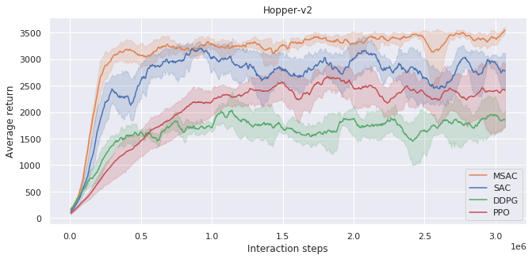
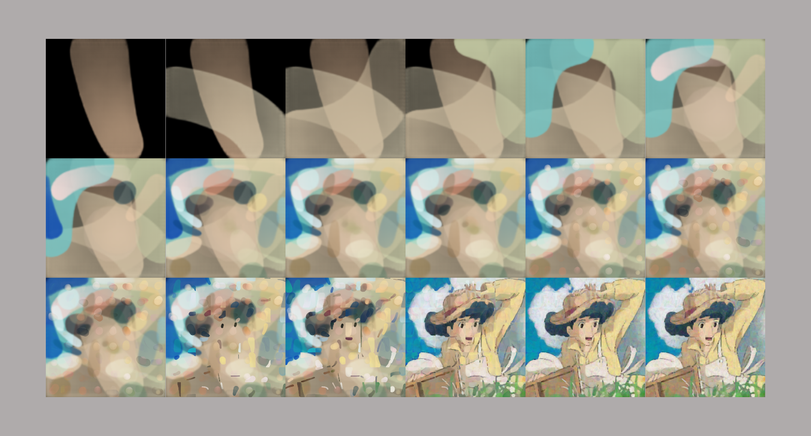

# MSAC
This repository is the source code of the "Model-Based Soft Actor-Critic" work in NCTU MLLab. Two main asks related to MSAC were carried out in this research. 

* The improvemtnt long-sight learning methods of MSAC were implemanted for the robotics task in Mujoco environment.

* A computer vision application is also implemented. This work demonstrates MSAC the painting task.

## Introduce
Deep reinforcement learning (DRL) has been shown to successfully developed for many domain. However, collecting new data in the actual environment requires a lot of cost and makes the agent learn slowly. It is meaningful to enhance sample efficiency and learn from a long-term perspective. In this study, we propose the model-based SAC where the environment dynamics are represented by deep model which allow agent to explore with augmented infomation. The future states are efficiently rolled out and employed in current policy with foresight information.

## Start experiment

### Mujoco
#### Environment
* OS : Ubuntu 18.04
* Nvidia Driver : 440.100
* CUDA : 10.2
* Python: 3.6
* PyTorch: 1.2.0
* gym: 0.15.6

The related python packages are listed in `requirements.txt.`
```bash
pip install virtualenv
virtualenv </path/to/venv> --python=python3
. </path/to/venv>/bin/activate
pip install -r requirements.txt
```

#### Run experiment

**training**
- Pass input arguments to the script or Modify the parameters at the bottom of script
- Please refer to args parser to see available parameters
- For other applications, you can directly adjust the hyperparameters of the update function
- Train model by
```bash
python msac_<version>.py 
```
The logs and temporary results will be printed to stdout and saved in the `./exp_name_%Y_%m_%d_%H_%M_%S` path.
All models used for training will also be saved in the `model` subdirectory.

**evaluation**

### Result


### Painting
#### Environment
* OS : Ubuntu 18.04
* Nvidia Driver : 410.129
* CUDA : 10.1
* Python 3.6
* PyTorch 1.4.0
* torchvision 0.5.0
* Pillow 8.0.0
* opencv-python 4.4.0.44

The related python packages are listed in `requirements.txt.`
```bash
pip install virtualenv
virtualenv </path/to/venv> --python=python3
. </path/to/venv>/bin/activate
pip install -r requirements.txt
```

#### Dataset
- Default usage data set:
http://mmlab.ie.cuhk.edu.hk/projects/CelebA.html

- Put the training image in the "data" folder
- The default image size is 128x128x3
- Any image data set can be used

#### Run experiment

**training**
```bash
python train_msac.py
```

**evaluation**
- put test data in "image" folder
```bash
python ./core/test_policy.py
```
- generated image will be in the "output" folder

### Result


### DEMO video
https://drive.google.com/file/d/1FbdUNXkrZao1SwVC4VHtDaO-Ulc4vnjK/view

## Reference
* "Openai baselines," https://github.com/openai/baselines,2017
* "TorchVision Resnet," https://github.com/pytorch/vision/blob/master/torchvision/models/resnet.py
* Z. Liu, P. Luo, X. Wang, and X. Tang, "Deep learning face attributes in the wild," in Proceedings of International Conference on Computer Vision (ICCV), December 2015.
